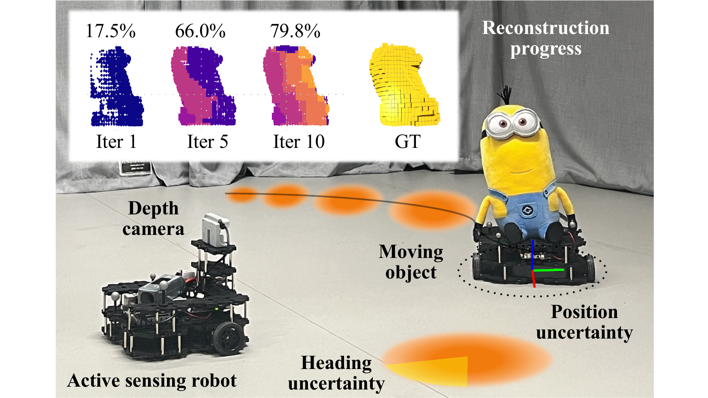
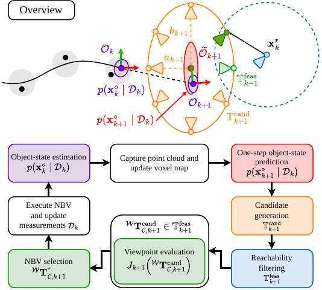
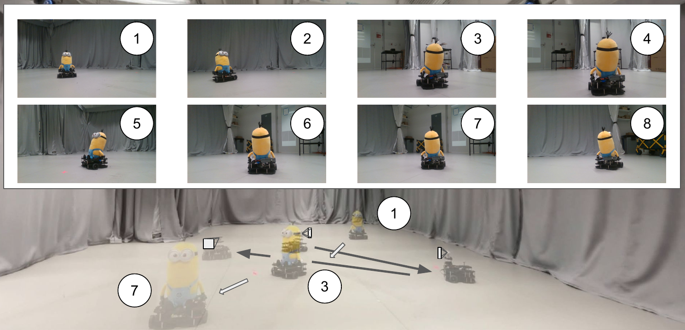

<div align="center">

# Motion-Uncertainty-Aware Next-Best-View Planning for Moving Object Reconstruction

[](https://docs.ros.org/en/jazzy/index.html)
[](https://www.python.org/)
[](https://arxiv.org/abs/2605.17593)

</div>

<p align="center">
  
</p>


## 🎉 This paper is accepted to Robotics: Science and Systems (RSS) 2026

## Overview

MUA-NBV is a ROS 2 implementation of paper - **[Motion Uncertainty-Aware Next-Best-View Planning for Moving Object Reconstruction](https://arxiv.org/abs/2605.17593)**

The framework addresses active 3D reconstruction of an unknown rigid object undergoing planar motion. At each planning step, the robot receives a depth observation and a noisy planar object-position measurement. A fixed-lag GP-based smoother estimates a Gaussian belief over object position and latent velocity, predicts one step ahead, and the planner selects the next viewpoint by maximizing expected coverage under this predictive uncertainty.

Code included in this release:

- object-state estimation and prediction from position measurements (`mua_nbv_prediction`)
- uncertainty-aware candidate generation and NBV scoring (`mua_nbv_planner`)
- Gazebo simulation and real-world testbed bringup (`simulation_bringup`, `testbed_bringup`)

## Method At A Glance

<p align="center">
  
</p>

At each planning iteration, the pipeline performs the following steps:

1. **Estimate and predict object state.**
   A fixed-lag GP-based smoother estimates the object's planar position and latent velocity from noisy position measurements, then propagates the belief one step ahead to the expected execution time.

2. **Generate candidate viewpoints.**
   Candidate viewpoints are sampled around the predicted object location using an uncertainty-adaptive ellipse whose axes expand with the predicted positional uncertainty.

3. **Filter reachable viewpoints.**
   Candidate viewpoints that cannot be reached within one The robot replans viewpoints as the object moves, changing its relative viewing angle instead of only maintaining proximity. This allows the depth camera to observe new object surfaces and incrementally improve reconstruction coverage.planning step under the robot motion limits are discarded.

4. **Evaluate expected coverage.**
   Each feasible viewpoint is evaluated by estimating its expected coverage-driven NBV score over samples from the predictive object-state belief.

5. **Execute and update.**
   The highest-scoring reachable viewpoint is executed. The new depth observation and object-position measurement are incorporated, and the loop repeats.

## Real-World Replanning Sequence

<p align="center">
  
</p>

This representative testbed sequence shows the planner operating in closed loop on a physical robot. As the object moves along the trajectory, the robot replans its camera viewpoint at each iteration. Rather than simply following the object, the planner changes the robot-object viewing geometry to expose previously unseen surfaces and improve reconstruction coverage over time.

## Repository Structure

```text
ws/src/
  mua_nbv_py_utils/      # math/transforms/pcd helpers
  mua_nbv_common/        # shared ROS utilities
  mua_nbv_prediction/    # object state prediction
  mua_nbv_planner/       # candidate generation + NBV scoring/selection
  simulation_bringup/    # Gazebo simulation runtime
  testbed_bringup/       # real-world/testbed runtime
```

## Environment Setup

### Prerequisites

- Ubuntu with ROS 2 Jazzy installed
- `python3-venv`, `python3-pip`, `ros-dev-tools`

### One-time setup

```bash
cd ~/mua-nbv
source /opt/ros/jazzy/setup.bash

# Creates .venv with --system-site-packages and installs pip deps.
source setup_env.sh

cd ws
rosdep install --from-paths src --ignore-src -r -y
colcon build --symlink-install
```

### Every new terminal

```bash
cd ~/mua-nbv
source /opt/ros/jazzy/setup.bash
source .venv/bin/activate
cd ws
source install/setup.bash
```

### Quick verification

```bash
ros2 pkg list | grep -E "mua_nbv_planner|mua_nbv_prediction|simulation_bringup|testbed_bringup"
python3 -c "import jax, open3d; print('jax', jax.__version__)"
```

## Usage

### Main experiment path

Terminal A:

```bash
cd ~/Desktop/mua-nbv/ws
source /opt/ros/jazzy/setup.bash
source ../.venv/bin/activate
source install/setup.bash

ros2 launch simulation_bringup simulation.launch.py \
  target_mode:=dynamic \
  pipeline_mode:=full \
  sim_config:=src/simulation_bringup/config/simulation.yaml \
  planner_config:=src/mua_nbv_planner/config/planner.yaml
```

Terminal B:

```bash
cd ~/Desktop/mua-nbv/ws
source /opt/ros/jazzy/setup.bash
source ../.venv/bin/activate
source install/setup.bash

ros2 run simulation_bringup experiment_coordinator \
  --ros-args -p target_mode:=dynamic -p pipeline_mode:=full -p iteration:=30
```

## Citation

Coming soon...